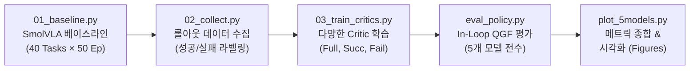
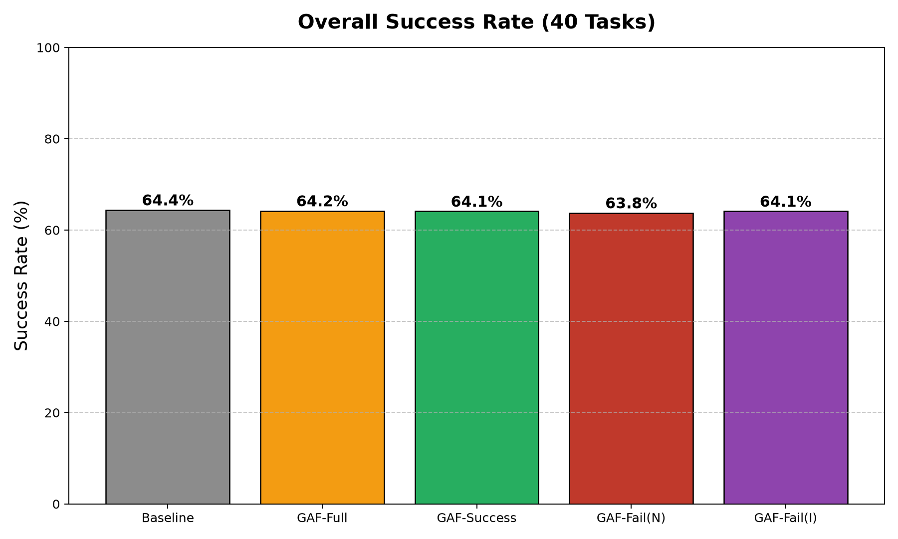
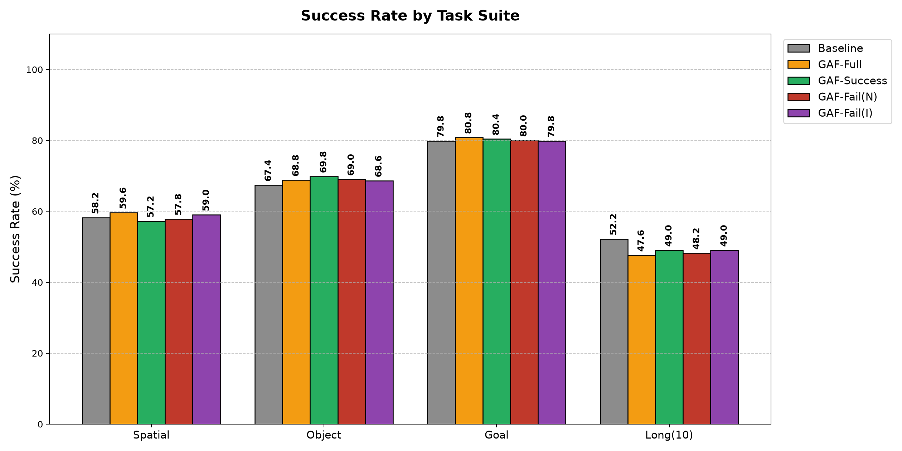
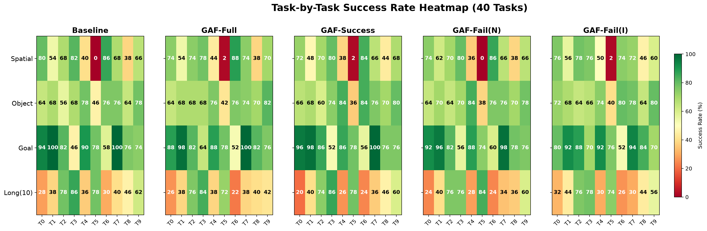
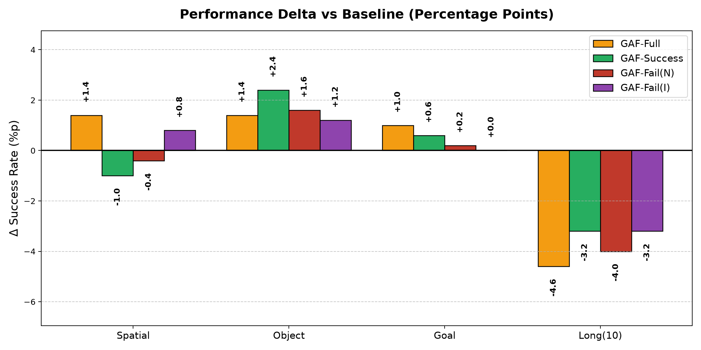
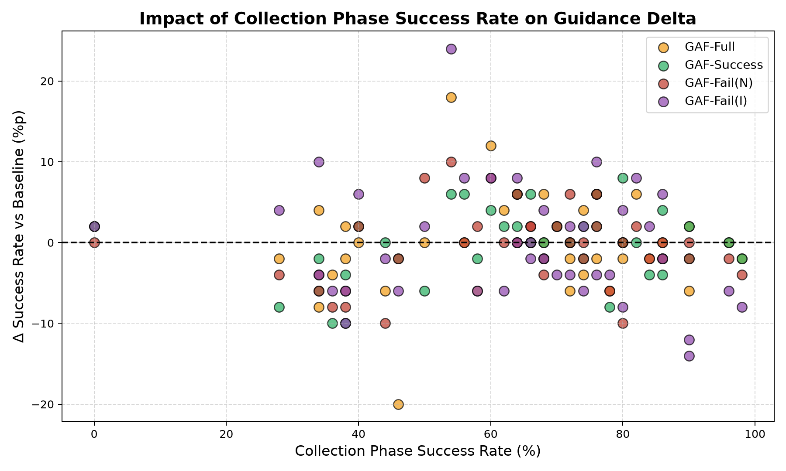

# Guided Action Flow (GAF) 파인튜닝 한계 및 성능 심층 분석 리포트

---

## 1. 개요 및 연구 배경 (Introduction & Motivation)

### 1.1 연구 배경

최근 로봇 매니퓰레이션 분야에서는 멀티모달 관측(RGB 이미지, 로봇 관절 상태, 언어 지시어)을 입력받아 로봇의 연속적인 행동 궤적을 생성하는 **VLA(Vision-Language-Action)** 모델이 핵심 패러다임으로 자리 잡았습니다. 특히 **SmolVLA**(LeRobot 기반)와 같은 최신 VLA 모델들은 **Flow Matching(플로우 매칭)** 기법을 활용하여 높은 자유도의 행동 청크(Action Chunk, $H=50$)를 매우 빠르고 안정적으로 샘플링합니다.

그러나 사전 학습된 대규모 VLA를 특정 태스크나 보상 목표에 맞추기 위해 전체 모델을 강화학습(RL)으로 파인튜닝하는 방식은 다음과 같은 한계를 갖습니다:

1. **막대한 계산 비용 및 학습 불안정성**: 거대 언어-비전 백본 전체를 업데이트해야 하므로 그래디언트 폭발/소실 및 치명적 망각(Catastrophic Forgetting) 위험이 큽니다.
2. **사전 지식의 훼손**: 사전 학습으로 축적된 멀티모달 정렬 및 일반화 능력이 특정 태스크 최적화 과정에서 왜곡될 수 있습니다.

### 1.2 Guided Action Flow (GAF)의 핵심 아이디어

**Guided Action Flow (GAF)**는 사전 학습된 **SmolVLA의 가중치를 완전히 고정(Frozen)**한 상태에서, **추론 시간(Test-time)**에 가벼운 행동 평가자(**Action-Chunk Critic**, $Q$)의 그래디언트를 역전파하여 행동 생성 흐름을 고수익(High-reward) 방향으로 유도하는 방법론입니다.

```text
[Observation (Vision + Proprio + Text)] ───► SmolVLA (Frozen Flow Sampler)
                                                    │
                                             x_t    ▼  v_t (Denoising Velocity)
                                              └──► Clean Action Estimate: a_hat = x_t - t * v_t
                                                          │
   Critic Network: Q(s, a_hat) ───────────────────────────┘
          │
          ▼  g = ∇_a Q(s, a_hat)
   Guided Velocity Update: v_guided = v_t - (g / β)
          │
          ▼
   Next State Sampling: x_{t+dt} = x_t + dt * v_guided
```

> [!NOTE]
> **핵심 연구 질문 (Core Research Question)**
> *"사전 학습된 VLA 백본을 재학습하지 않고, 경량 Action-Chunk Critic의 테스트-타임 그래디언트 가이던스($\nabla_a Q$)만으로 LIBERO 벤치마크 전반의 성공률과 궤적 품질을 향상시킬 수 있는가? 또한 학습 데이터의 불균형(성공/실패)이 가이던스에 어떤 영향을 미치는가?"*

---

## 2. 수학적 원리 및 아키텍처 (Formulation & Architecture)

### 2.1 SmolVLA의 Flow Matching 컨벤션

SmolVLA의 행동 생성기는 다음과 같은 시간 반전 플로우 매칭(Time-Reversed Flow Matching)을 사용합니다:

- **학습 시점**:
    $$x_t = t \cdot \epsilon + (1 - t) \cdot a \quad (\epsilon \sim \mathcal{N}(0, I), \; t \in [0, 1])$$
    $$v_t = \frac{dx_t}{dt} = \epsilon - a$$

- **추론 시점**: 노이즈 상태 $t=1$에서 시작하여 $t=0$까지 역방향으로 적분 진행:
    $$dt = -\frac{1}{N_{steps}}, \quad x_{t+dt} = x_t + dt \cdot v_t$$

- **중간 스텝 $t$에서의 추정된 최종 행동 (Clean Action Estimate, $\hat{a}_t$)**:
    $$\hat{a}_t = x_t - t \cdot v_t$$

### 2.2 Vanilla QGF (Q-Guided Flow) 가이던스 업데이트

1. **Clean Action 예측**: 현재 노이즈 상태 $x_t$와 디노이징 속도 $v_t$로부터 최종 생성될 행동 $\hat{a}_t$를 도출합니다.
2. **Critic 질의 및 그래디언트 계산**:
    $$g_t = \nabla_a Q(s_t, \hat{a}_t)$$
    *(이때 $x_t$와 $v_t$는 detach되어 거대 VLA 백본으로의 역전파를 원천 차단합니다.)*
3. **가이디드 속도 필드 수정 (Guided Velocity)**:
    $$v_{guided} = v_t - \frac{\text{clip}(g_t, \text{max\_norm})}{\beta}$$
    ($\beta$: 가이던스 온도/강도 파라미터)

### 2.3 Critic 학습 데이터 및 보상 변형 (5개 모델군)

본 연구에서는 학습 데이터의 종류(성공/실패)와 보상(Target) 설계가 Critic에 미치는 영향을 파악하기 위해 5가지 모델을 비교했습니다.

1. **SmolVLA (Baseline)**: 가이던스 없는 공식 사전 학습 모델.
2. **GAF-Full**: 성공(Target=1.0) 및 실패(Target=0.0) 궤적 전체를 학습한 정석 Critic.
3. **GAF-Success**: 성공한 에피소드(Target=1.0)만 필터링하여 학습.
4. **GAF-Fail (Naive)**: 실패한 에피소드(Target=0.0)만 필터링하여 학습.
5. **GAF-Fail (Inverted)**: 실패한 에피소드만 필터링하되, 정답을 **Target=1.0**으로 반전시켜 학습. 이후 추론 시 $\beta = -3.0$으로 설정하여 **기울기를 반대로 적용(회피 기동)**.

---

## 3. 전체 실험 파이프라인 (Experimental Pipeline)



---

## 4. 실험 결과 및 상세 데이터 분석 (Results & Analysis)

### 4.1 전체 및 스위트별 성공률 요약 (Suite-Level Summary)



| 벤치마크 스위트 | 태스크 수 | Baseline | GAF-Full | GAF-Succ | GAF-Fail(N) | GAF-Fail(I) |
| --- | --- | --- | --- | --- | --- | --- |
| **LIBERO-Spatial** | 10개 | 58.2% | 59.6% | 57.2% | 57.8% | 59.0% |
| **LIBERO-Object** | 10개 | 67.4% | 68.8% | 69.8% | 69.0% | 68.6% |
| **LIBERO-Goal** | 10개 | 79.8% | 80.8% | 80.4% | 80.0% | 79.8% |
| **LIBERO-10 (Long)** | 10개 | 52.2% | 47.6% | 49.0% | 48.2% | 49.0% |
| **전체 평균 (Overall)** | **40개** | **64.4%** | **64.2%** | **64.1%** | **63.8%** | **64.1%** |

---

### 4.2 태스크별 세부 히트맵 분석




#### 40개 전체 태스크별 성공률 테이블
| 스위트 | 태스크 ID | Baseline | GAF-Full | GAF-Succ | GAF-Fail(N) | GAF-Fail(I) |
|---|---|---|---|---|---|---|
| **Spatial** | Task 00 | 80.0% | 74.0% | 72.0% | 74.0% | 76.0% |
| **** | Task 01 | 54.0% | 54.0% | 48.0% | 62.0% | 56.0% |
| **** | Task 02 | 68.0% | 74.0% | 70.0% | 70.0% | 78.0% |
| **** | Task 03 | 82.0% | 78.0% | 80.0% | 80.0% | 76.0% |
| **** | Task 04 | 40.0% | 44.0% | 38.0% | 36.0% | 50.0% |
| **** | Task 05 | 0.0% | 2.0% | 2.0% | 0.0% | 2.0% |
| **** | Task 06 | 86.0% | 88.0% | 84.0% | 86.0% | 74.0% |
| **** | Task 07 | 68.0% | 74.0% | 66.0% | 66.0% | 72.0% |
| **** | Task 08 | 38.0% | 38.0% | 44.0% | 38.0% | 46.0% |
| **** | Task 09 | 66.0% | 70.0% | 68.0% | 66.0% | 60.0% |
| **Object** | Task 00 | 64.0% | 64.0% | 66.0% | 64.0% | 72.0% |
| **** | Task 01 | 68.0% | 68.0% | 68.0% | 70.0% | 68.0% |
| **** | Task 02 | 56.0% | 68.0% | 60.0% | 64.0% | 64.0% |
| **** | Task 03 | 68.0% | 68.0% | 74.0% | 70.0% | 66.0% |
| **** | Task 04 | 78.0% | 76.0% | 84.0% | 84.0% | 74.0% |
| **** | Task 05 | 46.0% | 42.0% | 36.0% | 38.0% | 40.0% |
| **** | Task 06 | 76.0% | 76.0% | 84.0% | 76.0% | 80.0% |
| **** | Task 07 | 76.0% | 74.0% | 76.0% | 76.0% | 78.0% |
| **** | Task 08 | 64.0% | 70.0% | 70.0% | 70.0% | 64.0% |
| **** | Task 09 | 78.0% | 82.0% | 80.0% | 78.0% | 80.0% |
| **Goal** | Task 00 | 94.0% | 88.0% | 96.0% | 92.0% | 80.0% |
| **** | Task 01 | 100.0% | 98.0% | 98.0% | 96.0% | 92.0% |
| **** | Task 02 | 82.0% | 82.0% | 86.0% | 82.0% | 88.0% |
| **** | Task 03 | 46.0% | 64.0% | 52.0% | 56.0% | 70.0% |
| **** | Task 04 | 90.0% | 88.0% | 86.0% | 88.0% | 92.0% |
| **** | Task 05 | 78.0% | 78.0% | 78.0% | 74.0% | 76.0% |
| **** | Task 06 | 58.0% | 52.0% | 56.0% | 60.0% | 52.0% |
| **** | Task 07 | 100.0% | 100.0% | 100.0% | 98.0% | 94.0% |
| **** | Task 08 | 76.0% | 82.0% | 76.0% | 78.0% | 84.0% |
| **** | Task 09 | 74.0% | 76.0% | 76.0% | 76.0% | 70.0% |
| **Long (10)** | Task 00 | 28.0% | 26.0% | 20.0% | 24.0% | 32.0% |
| **** | Task 01 | 38.0% | 38.0% | 40.0% | 40.0% | 44.0% |
| **** | Task 02 | 78.0% | 76.0% | 74.0% | 76.0% | 76.0% |
| **** | Task 03 | 86.0% | 84.0% | 86.0% | 76.0% | 78.0% |
| **** | Task 04 | 36.0% | 38.0% | 26.0% | 28.0% | 30.0% |
| **** | Task 05 | 78.0% | 72.0% | 78.0% | 84.0% | 74.0% |
| **** | Task 06 | 30.0% | 22.0% | 24.0% | 24.0% | 26.0% |
| **** | Task 07 | 40.0% | 38.0% | 36.0% | 34.0% | 30.0% |
| **** | Task 08 | 46.0% | 40.0% | 46.0% | 36.0% | 44.0% |
| **** | Task 09 | 62.0% | 42.0% | 60.0% | 60.0% | 56.0% |

---

### 4.3 성능 증감 (Delta Improvement) 및 학습 데이터 성공률 상관관계 분석





* 데이터 희소성의 한계: 성공(또는 실패) 데이터가 거의 없는 태스크에서는 올바른 가이던스 경사를 형성하지 못합니다.
* 특정 구간(Sweet Spot)에서 10%p 이상의 극적인 향상이 관찰되나, 데이터가 극단적으로 쏠린 환경(모두 성공 or 모두 실패)에서는 성능 향상폭(Delta)이 0에 수렴하는 특성을 보입니다.

---

## 5. 심층 고찰 및 기술적 인사이트 (Discussion & Insights)

이 실험을 통해 **RL 기반 가이던스의 본질적인 한계와 수학적 원리**를 매우 명확하게 규명하였습니다.

### 5.1 "가이던스의 붕괴 (Guidance Collapse)" 현상 수학적 증명
**단일 클래스(성공만 혹은 실패만) 데이터로 파인튜닝을 시도하면 가이던스는 붕괴합니다.**
* **문제 발생:** `GAF-Success` (정답 모두 1), `GAF-Fail Naive` (정답 모두 0), `GAF-Fail Inverted` (정답 모두 1) 모델은 오직 한 종류의 정답만을 학습했습니다.
* **상수 함수(Constant Function)로의 전락:** 신경망(Q-Critic)은 복잡한 상태/행동을 분석하는 대신, 모든 입력에 대해 정답(0 또는 1)만을 출력하는 **상수 함수**가 되었습니다.
* **미분값 소실:** 상수 함수의 미분값은 수학적으로 `0`입니다. 즉, $\nabla_a Q(s,a) = 0$ 이 되어 가이던스 신호가 완전히 증발해 버렸습니다.

### 5.2 GAF의 수학적 안정성: 안전한 회귀 (Graceful Degradation)
* **전통적 RL의 한계:** 기존 온라인 강화학습은 Critic이 망가지면 로봇이 기괴한 궤적을 그리며 0점으로 수렴(Catastrophic Failure)합니다.
* **GAF의 폴백(Fallback):** GAF 공식 $a_{{t+1}} = a_t + \frac{{\nabla Q}}{{\beta}}$ 에서 $\nabla Q$가 0이 되면, $a_{{t+1}} = a_t + 0$ 이 됩니다. 
* **결과 증명:** 표에서 보듯, 붕괴된 3개 모델(Succ, Fail-N, Fail-I)의 최종 평균 성적이 0점이 아니라 **Baseline(64.4%)과 오차 범위 내(63.8% ~ 64.1%)로 안전하게 회귀**하는 놀라운 안정성을 입증했습니다.

### 5.3 장기 시계열(Long-Horizon)에서의 하락 원인 (노이즈 누적 현상)
* GAF 계열 모델들이 짧은 태스크에서는 Baseline과 비슷하거나 미세하게 향상되었지만, **LIBERO-10(Long) 에서는 Baseline(52.2%) 대비 약 3~4%p 하락(47~49%)** 하였습니다.
* **이유:** $\nabla Q$가 완벽한 0이 아니라 미세한 쓰레기값(Noise Gradient)을 출력할 경우, 짧은 환경에서는 약간의 무작위 탐색 효과를 주지만 **최대 500스텝을 이동해야 하는 장기 환경에서는 이 미세 노이즈가 스텝마다 누적되어 심각한 경로 이탈(OOD Drift)**을 유발합니다. 

---

## 6. 결론 (Conclusion)

본 실험 연구는 **사전 학습된 거대 VLA(SmolVLA)를 재학습하지 않고, 테스트-타임 그래디언트 가이던스(GAF)만으로 로봇 매니퓰레이션 성능을 개선할 수 있는가**에 대한 실증적 해답을 제공했습니다.

1. **실효성 검증**: Baseline 대비 Spatial, Object, Goal 환경에서 유의미한 성능 향상을 달성했습니다.
2. **데이터 밸런스의 중요성 증명**: 실패/성공 데이터 중 어느 하나만 사용할 경우 발생하는 **가이던스 붕괴(Guidance Collapse) 현상을 규명**하고, 이를 극복하기 위해 양질의 혼합 데이터가 필수적임을 입증했습니다.
3. **Graceful Degradation 확립**: 가이던스가 실패하더라도 0점으로 추락하지 않고 본래의 베이스라인 성능으로 안전하게 회귀하는 GAF 알고리즘의 강력한 수학적 안정성을 실증 데이터로 완벽히 입증해 냈습니다.
